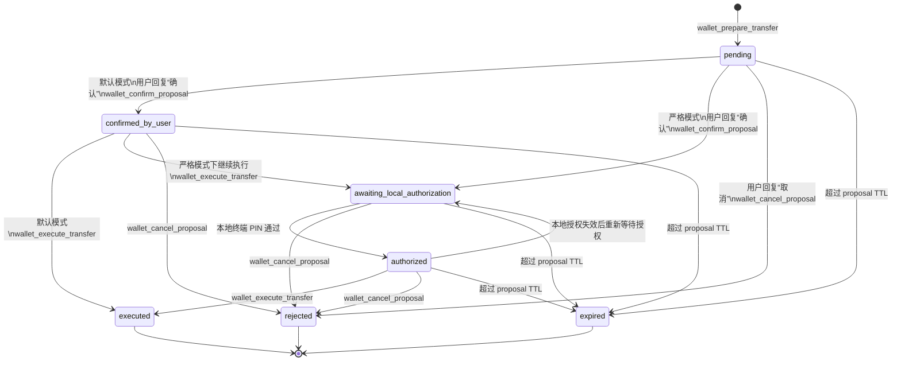
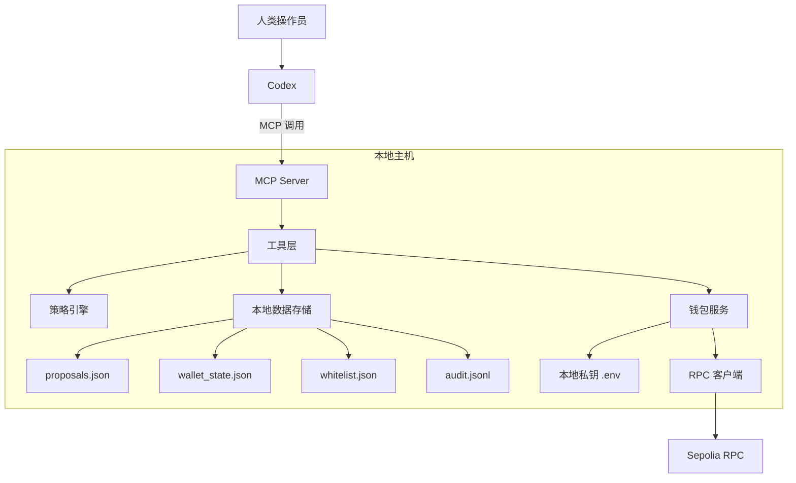
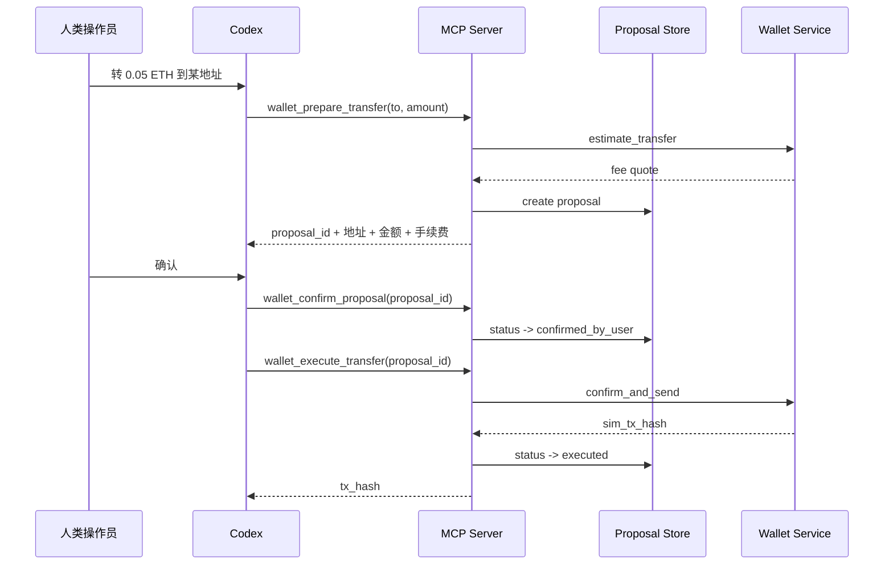
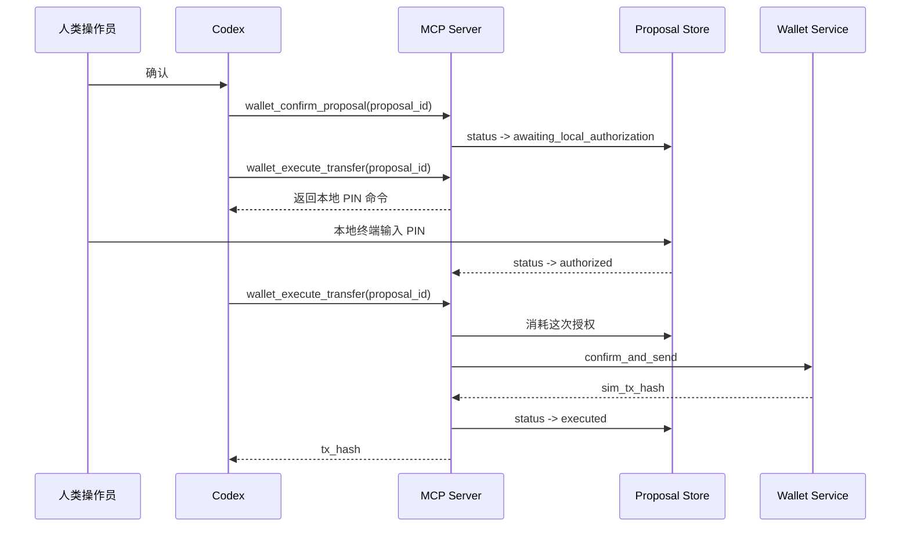

# COBO Wallet MCP 架构说明

## 1. 项目定位

这个项目是一个本地运行的 Python MCP Server，用来把钱包能力以工具形式提供给 Codex。

目标不是做完整商业钱包，而是做一个面向 AI Agent 的受控 Demo：

- Codex 能调用
- 能完成提案式转账
- 能体现最基本的权限边界
- 实现足够轻，便于演示和继续迭代

当前默认执行模式是：

- `DEMO_EXECUTION_MODE=simulate`
- 不真实广播到 Sepolia
- 但完整保留提案、确认、执行、查询状态流程
- 默认使用本地模拟余额，初始值可配置，当前设为 `50 ETH`
- 可选开启白名单，限制只允许向指定地址转账

## 2. 默认交互模式

当前默认模式已经恢复成更轻量的流程：

1. Codex 创建 proposal
2. Codex 展示金额、地址、手续费
3. 用户回复“确认”
4. Codex 调用 `wallet_confirm_proposal`
5. Codex 再调用 `wallet_execute_transfer`
6. MCP 执行模拟转账

这意味着：

- 你不需要再去本地终端手动运行命令
- 也不需要再额外输入 PIN
- 演示和日常试用会更顺手

代价也很明确：

- 安全边界比“双重确认”更弱
- 仍然不具备密码学级别的人类身份校验
- 但至少不会再出现“创建提案后立即直接执行”的一步直达

## 3. 可选严格模式

如果你之后想恢复更严格的交互，可以打开：

```env
DEMO_REQUIRE_LOCAL_AUTH=true
```

打开后流程变成：

1. Codex 创建 proposal
2. Codex 展示金额、地址、手续费
3. 用户回复“确认”
4. Codex 调用 `wallet_confirm_proposal`
5. MCP 把提案推进到 `awaiting_local_authorization`
6. 用户在本地终端输入 PIN
7. Codex 再调用 `wallet_execute_transfer`

严格模式下，本地授权是一次性、短时有效的。

## 4. MCP 工具分层

为了减少 Codex 需要理解的工具数量，现在 MCP 默认暴露的是“高层工具”，而不是所有内部步骤。

当前推荐的 MCP 工具分成六组：

转账主流程 6 个：
- `wallet_get_overview`
- `wallet_list_recipients`
- `wallet_prepare_transfer`
- `wallet_confirm_proposal`
- `wallet_execute_transfer`
- `wallet_get_transaction_status`

收款展示 1 个：
- `wallet_get_receive_card`

地址簿管理 3 个：
- `wallet_add_recipient`
- `wallet_update_recipient`
- `wallet_delete_recipient`

白名单管理 3 个：
- `wallet_list_whitelist`
- `wallet_allow_recipient`
- `wallet_revoke_recipient`

提案管理 3 个：
- `wallet_list_proposals`
- `wallet_get_proposal`
- `wallet_cancel_proposal`

历史查询 1 个：
- `wallet_list_transactions`

这样设计的原因是：

- 查询类动作可以打包
- 准备转账时本来就会做预估，没必要再拆一次
- 执行类动作可以对外包装成一个入口，由它决定“直接执行”还是“先去做本地授权”
- 收款信息虽然是只读能力，但使用场景和“转账给别人”不同，单独保留更清楚
- 联系人管理虽然不是转账主链路，但属于高频且完整的独立动作，单独保留更清晰
- 白名单管理虽然也和“收款对象”有关，但它承担的是权限边界，不应该和地址簿混成一个概念

内部模块仍然保留更细的职责拆分，但不再都暴露给 Codex。

## 5. 功能范围

### 5.1 只读工具

- `wallet_get_overview`
  - 返回账户、余额、策略和推荐调用顺序
- `wallet_list_recipients`
  - 返回联系人名称、别名和实际地址
- `wallet_get_receive_card`
  - 返回当前钱包的收款信息
  - 适合直接展示给用户或转发给别人
- `wallet_list_whitelist`
  - 返回当前允许转账的白名单地址
  - 开启白名单模式后，适合先给 Codex 做前置检查
- `wallet_get_transaction_status`
  - 查询交易状态
- `wallet_list_transactions`
  - 返回最近转账记录
  - 同时包含已执行与已取消的提案
  - 默认按最近一次状态变化时间倒序返回
- `wallet_list_proposals`
  - 返回提案列表
  - 默认优先展示未完成提案
  - 支持按状态筛选
- `wallet_get_proposal`
  - 返回单条提案的完整状态
  - 包括下一步可执行动作、是否还能取消、是否已经可执行

### 5.2 写入相关工具

- `wallet_add_recipient`
  - 新增联系人名称、地址、别名和备注
  - 新增后即可在 `to` 参数里直接使用名称或别名
- `wallet_update_recipient`
  - 更新已有联系人的名称、地址、别名或备注
  - 用 `name_or_alias` 来定位已有联系人
- `wallet_delete_recipient`
  - 删除已有联系人
  - 删除后不能再通过这个名称或别名发起转账
- `wallet_allow_recipient`
  - 把联系人或地址加入白名单
  - 开启白名单模式后，只有放行过的地址才允许转账
  - 默认只保存地址；只有显式传入 `name` 时才保存展示名
- `wallet_revoke_recipient`
  - 把联系人或地址移出白名单
  - 移出后，相关提案即使之前已经创建，也会被阻止继续确认或执行
- `wallet_prepare_transfer`
  - 解析联系人
  - 检查白名单
  - 检查余额
  - 创建提案
  - 返回联系人名称、实际地址、金额、手续费和确认卡片
- `wallet_confirm_proposal`
  - 记录用户已经在对话里明确确认这笔提案
  - 默认模式下会把提案推进到 `confirmed_by_user`
  - 严格模式下会把提案推进到 `awaiting_local_authorization`
- `wallet_cancel_proposal`
  - 取消尚未执行的提案
  - 取消后提案会进入 `rejected`
  - 后续不能再继续确认或执行
- `wallet_execute_transfer`
  - 默认模式下：执行已确认提案
  - 严格模式下：如果还没完成本地授权，会先返回本地授权指引；授权完成后再次调用即可执行

### 5.3 当前明确不做

- 不支持主网
- 不支持多钱包
- 不支持任意合约调用
- 不支持通用签名接口
- 不把私钥暴露给 Codex

## 6. 核心术语解释

| 名称 | 通俗解释 |
| --- | --- |
| `proposal_id` | 一笔待执行转账的编号 |
| `requested_to` | 用户原始输入的收款对象，可以是别名，也可以是地址 |
| `recipient_name` | 如果命中了地址簿，这里会保存联系人名称 |
| `to` | 收款地址，也就是转给谁 |
| `amount` | 转账金额 |
| `tx_hash` | 交易哈希，可以理解成交易流水号 |
| `intent_hash` | 对转账核心意图做的摘要，防止关键字段被篡改 |
| `pending` | 提案已创建，还未执行 |
| `confirmed_by_user` | 已记录用户在对话里明确确认，默认模式下此时才允许执行 |
| `awaiting_local_authorization` | 严格模式下，等待本地终端输入 PIN |
| `authorized` | 严格模式下，本地 PIN 已通过 |
| `executed` | 已执行 |
| `expired` | 已过期 |

## 7. 提案状态流转

提案状态不是随便变化的，而是跟工具调用顺序严格绑定。

当前完整状态集合是：

- `pending`
- `confirmed_by_user`
- `awaiting_local_authorization`
- `authorized`
- `executed`
- `rejected`
- `expired`

状态流转图如下：



### 7.1 各状态的通俗解释

- `pending`
  - 提案刚创建出来
  - Codex 已经拿到了金额、地址、手续费
  - 但用户还没明确回复“确认”或“取消”
- `confirmed_by_user`
  - 只会在默认模式出现
  - 表示用户已经确认，现在可以直接执行
- `awaiting_local_authorization`
  - 只会在严格模式出现
  - 表示用户已经确认，但本地 PIN 还没输入
  - 这时还不能真正执行转账
- `authorized`
  - 只会在严格模式出现
  - 表示本地 PIN 已通过，这时才允许执行
- `executed`
  - 转账已经执行完成
  - 在当前 Demo 里通常是本地模拟执行成功
- `rejected`
  - 提案被主动取消
  - 后续不能再继续确认或执行
- `expired`
  - 提案超过有效期仍未走完流程
  - 后续不能继续执行

### 7.2 什么情况下会看到 `pending`

`pending` 是最常见的“提案刚生成”状态。

出现条件：

1. 用户说“帮我向某地址或某联系人转 0.01 ETH”
2. Codex 调用 `wallet_prepare_transfer`
3. MCP 完成地址解析、手续费预估、余额检查
4. 成功创建 proposal

这时提案就会进入 `pending`。

它的真实含义是：

- 这笔转账已经被结构化记录
- 但还没有拿到用户最终确认

### 7.3 什么情况下会看到 `awaiting_local_authorization`

这个状态只会在严格模式出现，也就是：

```env
DEMO_REQUIRE_LOCAL_AUTH=true
```

出现条件通常有两种：

1. 用户已经在对话里回复“确认”，Codex 调用 `wallet_confirm_proposal`
2. Codex 在严格模式下继续调用 `wallet_execute_transfer`，系统发现还没完成本地授权，于是把提案推进到等待授权状态

它的真实含义是：

- 对话里的确认已经完成
- 但本地终端的人类授权还没完成
- 所以仍然不能签名执行

### 7.4 你当前默认更常看到哪条路线

当前项目默认是轻量模式：

```env
DEMO_REQUIRE_LOCAL_AUTH=false
```

所以你平时更常看到的是：

```text
pending -> confirmed_by_user -> executed
```

而不是：

```text
pending -> awaiting_local_authorization -> authorized -> executed
```

也就是说，如果你没有主动打开严格模式，就几乎不会看到 `awaiting_local_authorization`。

### 7.5 白名单如何影响提案状态

白名单不会引入新的 proposal 状态。

它的作用方式是：

- 在 `wallet_prepare_transfer` 时先拦截，未放行地址不能创建提案
- 在 `wallet_confirm_proposal` 和 `wallet_execute_transfer` 时再次校验，避免提案创建后策略变化
- 如果某条提案创建成功后，目标地址后来被移出白名单，这条提案不会变成新状态
- 而是继续保留原状态，但会显示：
  - `ready_for_execution=false`
  - `blocked_reason=...`
  - `next_allowed_actions` 只剩 `wallet_cancel_proposal`

这样做的原因是：

- 状态机保持简单，不为了白名单再引入一个新状态
- 但策略边界仍然是实时生效的，不会让旧提案绕过新限制

## 8. 系统结构



补充说明：

- 本地地址簿存放在 [address_book.json](/Users/william/cobo/data/address_book.json)
- 本地钱包状态存放在 [wallet_state.json](/Users/william/cobo/data/wallet_state.json)
- `simulate` 模式下的余额不再单独存在 `simulated_balance.json`
- `.env` 中的 `DEMO_SIMULATED_BALANCE_ETH` 只用于初始化钱包状态
- 本地白名单存放在 [whitelist.json](/Users/william/cobo/data/whitelist.json)
- Codex 可以先调用 `wallet_list_recipients`
- 如果开启了白名单，也可以先调用 `wallet_list_whitelist`
- 然后再把自然语言里的“向某某转账”解析成实际链上地址

## 9. 执行时序

### 9.1 默认模式



### 9.2 严格模式



## 10. 权限边界

| 层级 | 允许做什么 | 不允许做什么 |
| --- | --- | --- |
| Codex | 创建提案、展示信息、确认执行 | 读取私钥、导出私钥、直接签任意原始交易 |
| MCP Server | 校验输入、维护提案状态、调用钱包服务 | 开放通用签名接口 |
| 本地用户 | 配置环境变量、决定是否开启严格模式 | 把私钥交给模型 |
| 本地私钥 | 仅用于本地钱包服务 | 出现在 MCP 返回值或日志里 |

## 11. 风险控制

默认模式下已经保留的控制：

- 必须先创建 proposal
- 执行前必须把联系人名称、实际地址、金额、手续费展示出来
- 执行前必须先写入一条“用户已确认”的状态
- 可选开启白名单，只允许向已放行地址转账
- 白名单会在创建提案和执行前双重校验
- 有链限制和金额上限
- 提案有过期时间
- 已执行提案不能重复执行
- 私钥只保留在本地 `.env`

但默认模式取消了“本地 PIN 二次确认”，所以风险也更高：

- Prompt Injection 的防线更弱
- 误确认后会更容易直接执行
- 更适合本地 Demo，不适合真实资金场景

## 12. 当前实现状态

已经完成：

- Python MCP Server
- 本地 proposal 存储
- 审计日志
- CLI 演示命令
- Codex MCP 集成
- 默认模式的“提案 -> 用户确认 -> 执行”状态机
- 可选严格模式本地 PIN 授权
- 本地模拟执行与交易状态查询
- 可选白名单限制与白名单管理工具

暂未完成：

- `DEMO_EXECUTION_MODE=sepolia` 的真实广播
- 更强的签名隔离，例如独立签名进程或硬件钱包
- 多账户与多策略

## 13. 推荐演示方式

如果你的目标是“让体验顺手、先把 Agent Tool 跑通”，最适合当前版本的方式就是：

1. 用 Codex 调用 `wallet_prepare_transfer`
2. 让 Codex 把金额、地址、手续费展示出来
3. 你回复“确认”
4. Codex 调用 `wallet_confirm_proposal`
5. Codex 调用 `wallet_execute_transfer`
6. 再查询模拟交易状态

如果你之后又想把安全边界抬高，再把 `DEMO_REQUIRE_LOCAL_AUTH=true` 打开即可。
