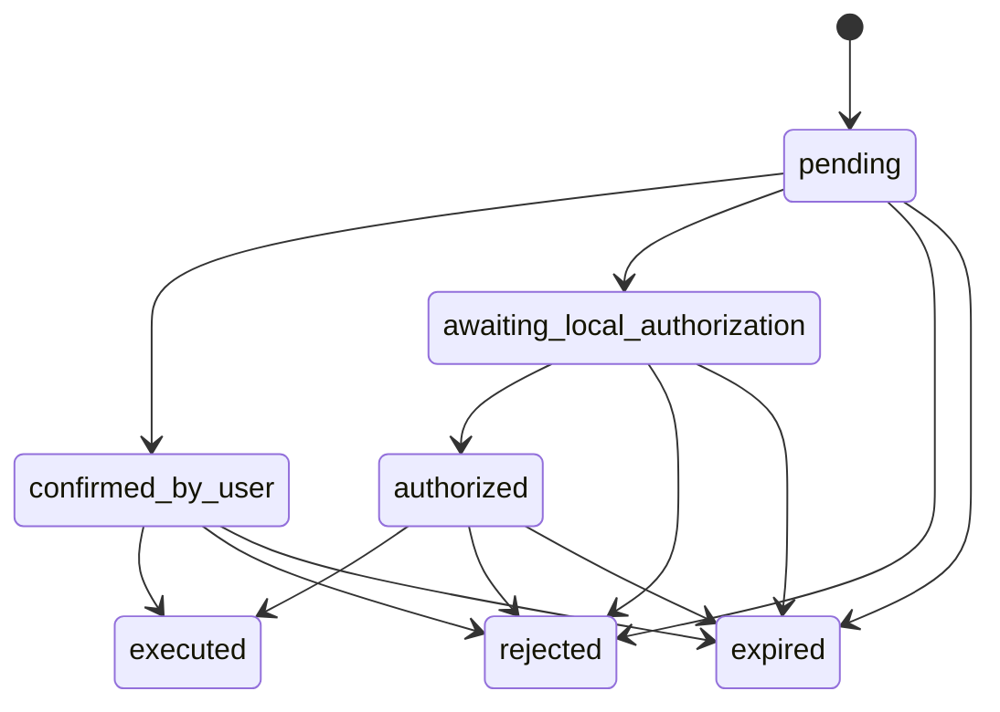

# COBO Wallet MCP 架构设计

## 1. 项目目标

本项目是一个用 Python 实现的本地 MCP Server，用来把钱包能力以工具形式提供给 Codex 等 AI Agent。

当前版本的目标不是做一个完整商业钱包，而是完成一个可运行的 AI Agent 钱包 Demo，重点展示三件事：

- Agent 可以调用钱包能力
- 转账必须经过 `proposal -> 确认 -> 执行` 的受控流程
- 敏感配置与普通转账能力之间存在明确的权限边界

当前默认运行方式：

- 执行模式：`simulate`
- 默认资产：`ETH`
- 默认网络：Ethereum Sepolia
- 默认余额：本地模拟余额，初始值可由配置提供

## 2. 设计范围

### 2.1 当前要解决的问题

- 让 Agent 能通过自然语言驱动钱包操作
- 让用户在执行前看到清晰的金额、地址和手续费
- 让敏感配置不直接暴露给 Agent
- 让本地 Demo 可以完整跑通创建提案、确认、执行、查询历史的闭环

### 2.2 当前明确不做

- 主网真实资产托管
- 多钱包与多账户体系
- 任意合约调用
- 通用签名接口
- 生产级签名隔离

## 3. 核心模块设计

### 3.1 MCP Server

MCP Server 是 Agent 的唯一钱包入口，对外暴露高层工具，而不是底层实现细节。它的职责是：

- 接收 Agent 的工具调用
- 构建运行时上下文
- 调用策略引擎、钱包服务和存储层
- 返回结构化结果给 Codex

### 3.2 工具层

工具层负责把钱包能力包装成可被 Agent 直接调用的 MCP 工具。当前工具可按职责分成四类：

| 类别 | 工具 |
| --- | --- |
| 总览与查询 | `wallet_get_overview` `wallet_get_transaction_status` |
| 转账主流程 | `wallet_prepare_transfer` `wallet_confirm_proposal` `wallet_execute_transfer` |
| 提案与历史 | `wallet_list_proposals` `wallet_get_proposal` `wallet_cancel_proposal` `wallet_list_transactions` |
| 辅助只读 | `wallet_list_recipients` `wallet_list_whitelist` `wallet_get_receive_card` |

设计原则是：

- Agent 只接触“够用的高层工具”
- 减少多步底层调用带来的误用风险
- 敏感写操作不暴露给 Agent

### 3.3 策略引擎

策略引擎负责所有运行时约束校验，包括：

- 链 ID 校验
- 金额格式与单笔限额校验
- 白名单校验
- 写入权限校验
- 提案状态合法性校验

它的作用是把“能不能做”从业务逻辑中抽离出来，避免工具层绕过安全约束。

### 3.4 钱包服务

钱包服务负责执行与资产相关的核心逻辑，包括：

- 余额读取
- 手续费估算
- 模拟扣款
- 生成模拟交易结果
- 为未来真实链广播预留接口

当前默认只做本地模拟执行，不向真实链广播交易。

### 3.5 Operator Console

Operator Console 是人工后台，只给本地操作员使用。它负责处理不适合交给 Agent 的敏感动作，包括：

- 私钥与 RPC 配置
- 模拟余额调整
- 白名单管理
- 地址簿管理
- 策略与权限开关修改

这层的存在，是为了把“Agent 可用能力”和“管理员能力”明确隔离。

## 4. 核心交互流程

### 4.1 默认流程

当前默认流程如下：

1. 用户提出转账请求
2. Codex 调用 `wallet_prepare_transfer`
3. 系统解析收款对象、检查余额和白名单、估算手续费、创建 proposal
4. Codex 向用户展示金额、地址、手续费
5. 用户回复“确认”
6. Codex 调用 `wallet_confirm_proposal`
7. Codex 调用 `wallet_execute_transfer`
8. 钱包服务完成本地模拟执行并写入交易结果

### 4.2 严格模式

如果打开 `DEMO_REQUIRE_LOCAL_AUTH=true`，流程会在“用户确认”之后增加一次本地授权步骤：

- proposal 在确认后进入 `awaiting_local_authorization`
- 本地终端完成 PIN 授权后才允许执行

因此：

- 默认模式更适合 Demo 演示
- 严格模式更适合强调人工二次确认

## 5. 提案状态设计

Proposal 是当前系统的核心状态对象。它把“用户表达想转账”与“系统真正执行转账”分成两个阶段。

当前状态集合如下：

| 状态 | 含义 |
| --- | --- |
| `pending` | 提案已创建，等待用户确认 |
| `confirmed_by_user` | 用户已确认，默认模式下可直接执行 |
| `awaiting_local_authorization` | 严格模式下等待本地 PIN 授权 |
| `authorized` | 严格模式下已完成本地授权 |
| `executed` | 已执行完成 |
| `rejected` | 已取消 |
| `expired` | 已过期 |

状态流转如下：

这个状态机的意义是：

- 防止一句话直接完成转账
- 支持执行前人工确认
- 让取消、过期、授权失败等情况都可追踪

## 6. 数据存储设计

当前系统使用本地文件存储，目的是降低 Demo 复杂度并保证易于检查。

| 文件 | 作用 | 主要写入者 |
| --- | --- | --- |
| `.env` | 私钥、RPC、策略开关、管理员 PIN | Operator Console / 人工 |
| `wallet_state.json` | 当前钱包状态与模拟余额 | 钱包服务、Operator Console |
| `proposals.json` | 提案与状态流转 | MCP Server |
| `address_book.json` | 联系人与别名 | Operator Console |
| `whitelist.json` | 白名单地址 | Operator Console |
| `funding_events.jsonl` | 人工入金、出金、设余额记录 | Operator Console |
| `audit.jsonl` | 工具调用与后台动作审计日志 | MCP Server、Operator Console |

这种设计的优点是：

- 数据结构直观
- 易于调试与验收
- 适合本地 Demo 和作业提交

代价是：

- 不适合高并发
- 不适合生产环境审计要求

## 7. 权限边界设计

权限边界是本项目架构设计的重点。

| 接口面 | 允许做什么 | 不允许做什么 |
| --- | --- | --- |
| Agent / MCP 工具 | 查询、创建提案、确认提案、执行受控转账、查看历史 | 改私钥、改白名单、改地址簿、改策略、直接读取私钥 |
| Operator Console | 管理私钥、RPC、模拟余额、白名单、地址簿、策略 | 代替 Agent 自动完成聊天式转账 |
| 钱包服务 | 估算、校验、模拟执行 | 暴露通用签名接口给 Agent |

这套边界的核心思想是：

- Agent 负责“使用钱包”
- 人工后台负责“管理钱包”

## 8. 风险控制设计

当前版本保留的主要控制包括：

- 所有转账必须先创建 proposal
- 执行前必须展示金额、地址、手续费
- 执行前必须记录一条“用户已确认”状态
- 白名单可选开启，并在创建和执行前双重校验
- 支持链限制、单笔限额和提案过期
- 已执行提案不能重复执行
- 私钥只保留在本地环境中

当前版本仍然存在的限制包括：

- 默认模式下没有强制本地二次授权
- 当前主模式是 `simulate`，不是真实广播
- 仍属于 Demo 级实现，不是生产级安全系统

## 9. 当前实现状态

### 9.1 已完成

- Python MCP Server
- 面向 Codex 的高层工具集
- proposal 状态机
- 本地模拟执行
- 提案、交易、白名单、地址簿、本地状态存储
- 审计日志
- Streamlit Operator Console

### 9.2 暂未完成

- `DEMO_EXECUTION_MODE=sepolia` 的完整真实广播
- 更强的签名隔离方案
- 多账户、多策略和生产级权限体系

## 10. 架构结论

当前架构的核心思路可以概括为一句话：

在本地环境中，用 MCP 把钱包能力暴露给 AI Agent，同时用 proposal 流程、策略引擎和 Operator Console 把风险控制在受限边界内。

因此，这个项目作为作业提交版本已经具备较完整的架构闭环：

- 有明确的系统分层
- 有清晰的状态机
- 有可解释的权限边界
- 有可运行的最小实现路径

它适合作为 AI Agent 钱包 Demo 的架构设计方案，但仍不应被视为生产级钱包架构。
